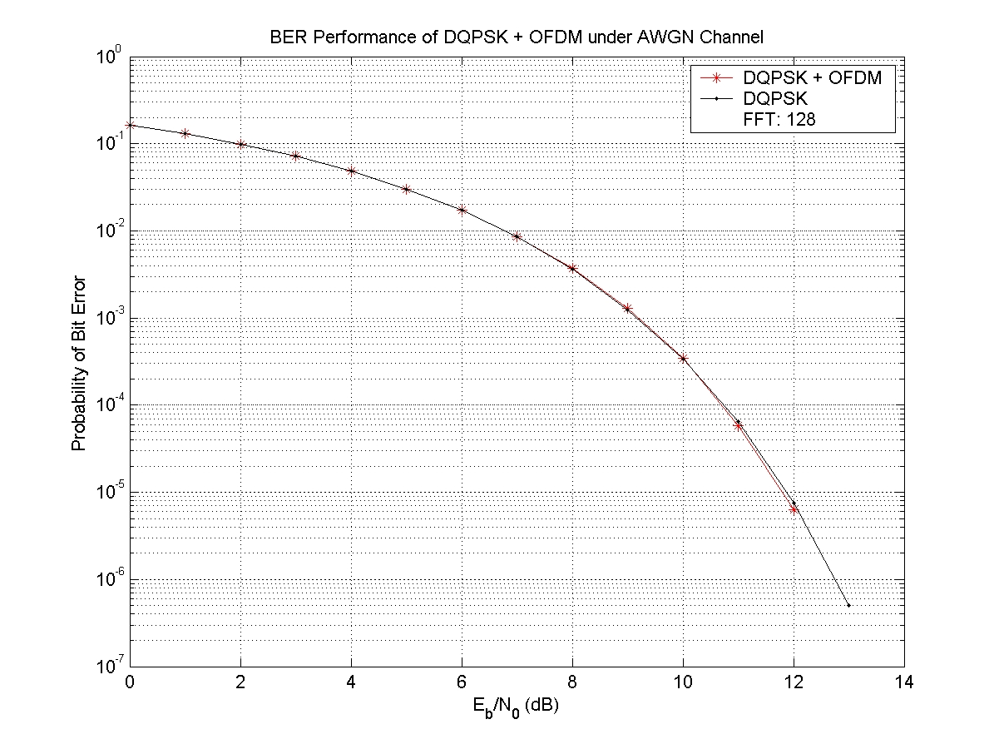
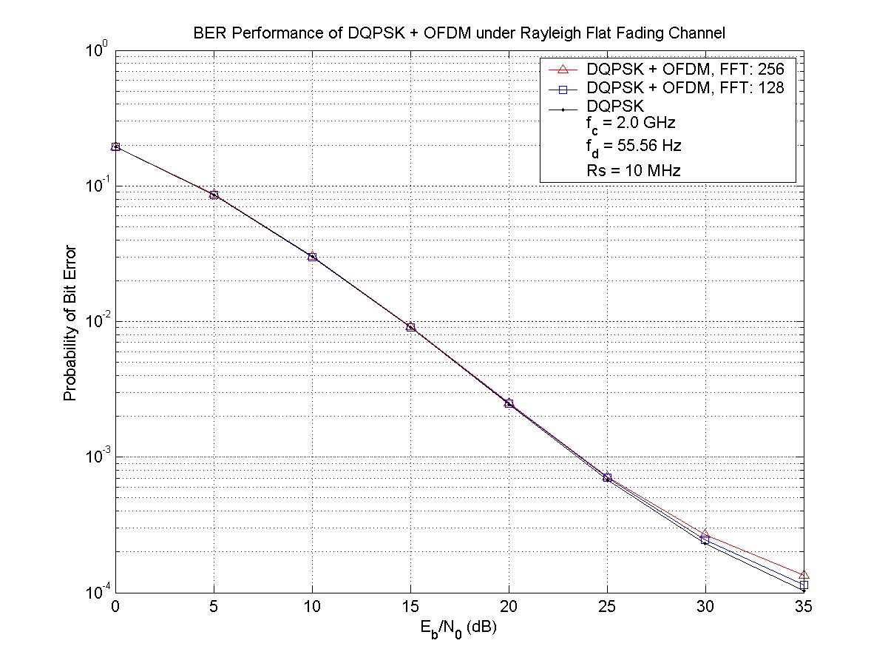

### OFDM (Orthogonal Frequency Division Multiplexing) with DQPSK (Differential Quadrqture Phase Shift Keying) 

* AWGN channel: DQPSK + OFDM with FFT size = 128
* Fading channel: DQPSK + OFDM with FFT size = 128 and 256

#### Performance Evaluation

